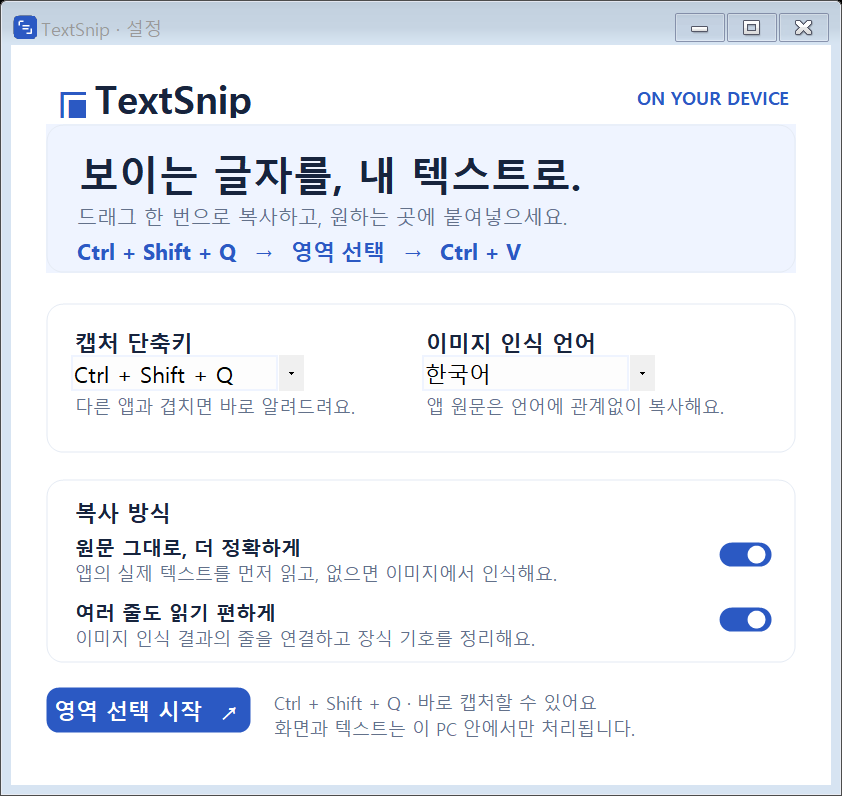

# TextSnip

**보이는 글자를, 내 텍스트로.**

Windows에서 단축키로 화면 속 텍스트를 선택하고 바로 붙여넣는 무료 로컬 앱입니다. 지원되는 앱에서는 원문을 직접 가져오고, 이미지·영상에서는 Windows OCR을 사용합니다.



## 다운로드 및 시작

[Windows 실행용 ZIP 다운로드](https://github.com/yoshi-power/TextSnip/releases/download/v0.1.0/TextSnip-0.1.0-windows.zip) · [릴리스 및 변경 사항](https://github.com/yoshi-power/TextSnip/releases)

위 실행용 ZIP을 내려받으세요. 저장소의 **Code → Download ZIP**은 개발용 소스이며 실행 파일을 포함하지 않습니다.

1. ZIP을 모두 압축 해제합니다.
2. `TextSnip/Start.cmd`를 실행합니다.
3. **Ctrl + Shift + Q**를 누르고 필요한 영역을 드래그합니다.
4. 복사 완료 알림 후 **Ctrl + V**로 붙여넣습니다.

단축키가 이미 사용 중이면 다른 조합으로 전환됩니다. 설정 창에 표시된 최종 단축키를 확인하세요. 설정 창의 X는 앱을 트레이로 숨깁니다. 완전 종료는 트레이 아이콘 우클릭 → TextSnip 종료입니다.

## 지원 환경

- Windows 10/11. .NET Framework 4.8 권장.
- Windows x64에서 검증했습니다. macOS/Linux는 지원하지 않습니다.
- API 키, 계정, 유료 구독 없이 동작합니다.
- 이미지 OCR에는 해당 Windows OCR 언어 팩이 필요합니다.

언어 팩이 없는 PC에서는 동봉된 `Install-OCR.cmd`로 한국어·영어·일본어 OCR을 설치할 수 있습니다. 이 설치에는 인터넷과 관리자 승인이 필요합니다. 설치 후 TextSnip을 종료했다가 다시 실행하세요. 앱 원문을 읽을 수 있는 화면은 OCR 언어가 없어도 이용할 수 있습니다.

## 주요 기능

- 앱 원문 우선: 접근성 텍스트를 가져와 숫자·기호·고유명사를 보존합니다.
- 로컬 OCR: 원문을 읽을 수 없는 화면에서는 캡처한 이미지로 전환합니다.
- 한국어·영어·일본어 OCR 언어 선택.
- 결과 창 없이 자동 복사, 포커스를 빼앗지 않는 완료 알림.
- 문장 줄 연결, 장식 기호 필터, 제한적인 사전 보정. 설정에서 끌 수 있습니다.
- 한 손 단축키, 영역 크기 안내, 짧은 전환 애니메이션.

## 정확도와 개인정보

모든 앱이 원문 접근성을 제공하지는 않습니다. `원문 복사 완료`와 `OCR 복사 완료` 알림으로 사용된 방식을 구분합니다. OCR에서는 0/O 혼동, 기호 누락, 문단·다단 문서 처리 오류가 남을 수 있습니다. 숫자·코드 등은 결과를 확인하고 필요하면 결과 정리를 끄세요.

앱은 화면과 텍스트를 외부 서버로 보내지 않습니다. 임시 캡처 이미지는 처리 후 삭제합니다. 강제 종료 시 임시 파일이 남을 수 있으며 Windows 클립보드 기록·동기화는 별도로 적용됩니다.

이 초기 배포본은 코드 서명되지 않았으므로 Windows에서 실행 경고가 나올 수 있습니다. 공식 릴리스 출처와 SHA256을 확인하세요. 보안 기능을 끄도록 요구하지 않습니다. 설치 프로그램이나 자동 업데이트는 포함하지 않습니다.

## 개발

Windows PowerShell과 Windows 기본 .NET Framework C# 컴파일러로 빌드합니다. 추가 NuGet 의존성은 없습니다.

```powershell
powershell.exe -NoProfile -ExecutionPolicy Bypass -File .\Build.ps1
.\TextSnip.exe --self-test
.\TextSnip.exe --direct-test
powershell.exe -NoProfile -ExecutionPolicy Bypass -File .\Package.ps1
```

실행 중인 앱을 덮어쓰지 않으려면 `Build.ps1 -OutputName TextSnip.next.exe`를 사용하세요. `Package.ps1`은 격리된 빌드 폴더에서 배포 ZIP과 SHA256을 생성합니다.

- `TextSnip.cs`: 트레이 앱, 설정, 단축키와 캡처 흐름
- `DirectText.cs`: 시간 제한이 있는 별도 프로세스에서 원문 추출
- `Ocr.ps1`: Windows OCR
- `TextCleanup.cs`: OCR 결과 정리
- `Design.cs`: UI 컴포넌트와 알림
- `CleanupTests.cs`, `DirectTextTests.cs`: 회귀 검사와 실제 접근성 테스트 창

`--self-test`는 생성 이미지로 OCR을 검사하며 로그를 실행 폴더에 기록합니다. `--direct-test`는 자체 테스트 창을 잠시 열고 자동 종료합니다. 다른 사람의 화면이나 기존 클립보드 내용을 테스트용으로 수집하지 않습니다.

검증 범위: 20개 후처리 회귀 검사, 세 언어 OCR, 다중 행 이미지, 원문 문자 보존, 영역 경계, 이미지 fallback, 화면 변경 감지, 배포 ZIP의 압축 해제 후 실행. 아직 여러 PC와 브라우저 버전 전반을 검증한 것은 아닙니다.

## 배포 구성

ZIP에는 실행 파일, OCR 스크립트, 시작 실행기, 선택적 언어 설치 도우미, 빠른 시작 안내와 아이콘만 포함됩니다. 개인 설정, 개발 백업, 로그인 정보, 테스트 로그는 포함하지 않습니다.

설정 위치: `%LOCALAPPDATA%\TextSnip\settings.txt`